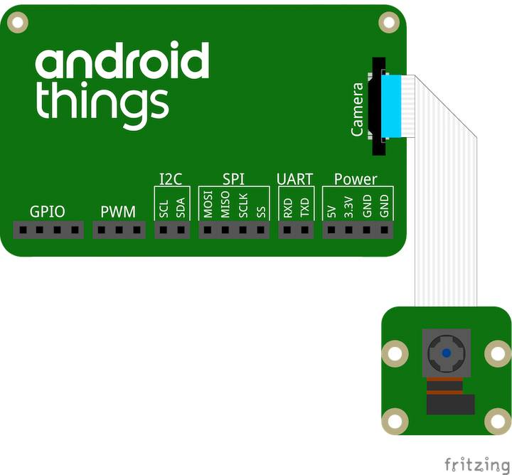

Please use this repository to maintain your work for the team project.

Also please fill the following details:

- Team name: Cartofi Prajiti

Students (SCS username - Name):

- saie2216 -> Sabadis Andreea
- slie2217 -> Sabou Lorena
- plie2203 -> Pop Lorena
- oeie2190 -> Obreja Elena


Project idea:
Estimate the number of persons in a room.  
- Using the video feed or static images detect the number of persons in a room.  
- Train the model using TensorFlow.  
- Record the values over time.  
- Present historical data over time.  


=============

This solution shows how we can use a camera device in order to detect how many persons enter in a room. 
The client side is a simple web application displaying the image shot, the results of the prediction and an update button.
The page communicates with the backend -> a machine learning server via REST API calls which outputs the received prediction.

## Demo


Full video: androidThings.mp4

## PIServer
The PI server is used in order to retrieve screenshots from a particular meeting room.
The images are used by the machine learning model - yolo3 library -  in order to make a prediction regarding
the number of persons in the room.

## Machine learning model
The server responds to the rest request from the client, returning the number of persons for each available room.
An example of response from the master server is as follows:
```
{
    "rooms": [
        {
            "num_persons": 2,
            "room_name": "Room #3",
	    "image": "base64 string"
        }
    ]
}
```

## Client
In the client side, a simple web page is displayed, created using Bootstrap, which shows the number of persons for each available room.
The user can also view a 'live feed' of the model's bounding box detections by accessing the 'view feed' functionality.


## Pre-requisites

- Android Things compatible board
- Android Studio 2.2+
- 1 Android Things compatible camera

## Schematics



## Build and install

# PIServer

On Android Studio, click on the "Run" button.

If you prefer to run on the command line, type

```bash
./gradlew installDebug
adb shell am start ro.ubbcluj.cs.tamasf.roomspy/.MainActivity
```

If you have everything set up correctly, the server should be sending data to the client.

# Machine learning server
First make sure that all of the necessary dependencies are installed by running the following command:

```
pip install -r requirements.txt
```

Since the server is dependent on the machine learning model we first need to retrieve it using the helper script:
```
chmod +x get_yolo.sh
./get_yolo.sh
```

Now we can start the server by running the following command:

```
python3 server.py
```

The server should now be running and handling requests from the client.

# Client
Install all the necessary packages:
```
npm install
```

Run the project:
```
npm start
```

=============
